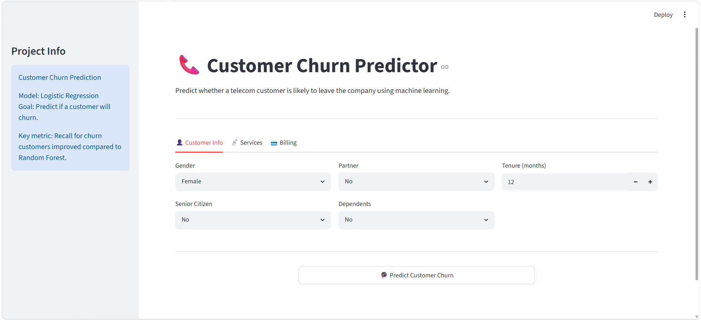
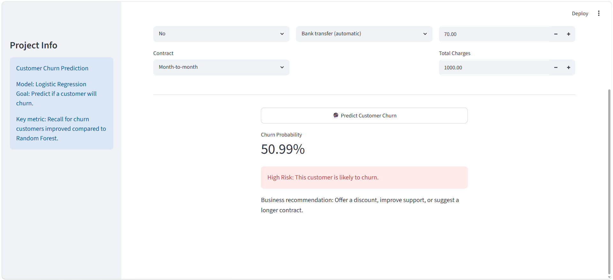

# 📞  Customer Churn Prediction

## 📌 Project Overview

This project predicts whether a telecom customer is likely to leave the company using machine learning classification techniques.

The goal is to help businesses identify high-risk customers and improve customer retention strategies.

---

## 🎯 Problem Statement

Customer churn directly affects business growth and profitability.

This project helps companies proactively identify customers who are likely to leave and take preventive actions.

---

## 📊 Model Performance

| Metric            | Value |
| ----------------- | ----: |
| Accuracy          | 80.3% |
| Precision (Churn) |  0.65 |
| Recall (Churn)    |  0.56 |
| F1 Score (Churn)  |  0.60 |

---

## 🚀 Features

* Data preprocessing
* Feature encoding
* Customer churn prediction
* Probability estimation
* Interactive Streamlit interface

---

## 🛠️ Technologies Used

* Python
* Pandas
* NumPy
* Scikit-Learn
* Streamlit

---

## 📷 Application Preview

---

## 📁 Project Structure

customer-churn-predictor/

├── app.py

├── requirements.txt

├── churn.ipynb

├── README.md

├── home.png

└── prediction.png

---

## 💡 Future Improvements

* Advanced feature engineering
* Additional classification models
* Customer segmentation
* Online deployment
